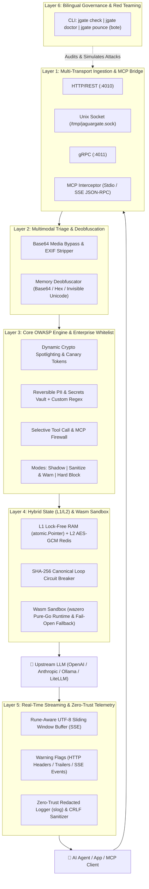

# 🐆 JaguarGate (`jgate`)

> **Ultra-low latency AI, Autonomous Agent & MCP Security Gateway in Go.**  
> *Named after Panthera onca (the Brazilian Jaguar — from Tupi "Yaguara", the predator that neutralizes threats in a single leap).*

[](https://go.dev/)
[](LICENSE)
[](https://owasp.org/www-project-top-10-for-large-language-model-applications/)
[](README_pt-BR.md)

🌍 **Read in other languages:** [Português (Brasil) 🇧🇷](README_pt-BR.md)

---

## ⚡ Why JaguarGate?

**JaguarGate** is a **framework-agnostic LLM & MCP traffic policy gateway** built in pure Go (`CGO_ENABLED=0`), designed as a resilient network/sidecar boundary **complementary to application-level guardrails** (such as Pydantic AI, LangChain, CrewAI, or custom SDK hooks — *Defense-in-Depth*):

> **Architectural Boundary:** Business-level authorization (user RBAC, payment limits, human-in-the-loop approval) belongs inside the application executor. **JaguarGate** enforces unified network-level traffic policies across heterogeneous stacks (Python, Go, Node.js, Ruby, Java), preventing sensitive data from leaving your perimeter to external LLM providers.

* 🛡️ **Graceful Degradation & Semantic Veto Feedback:** If an agent emits 3 tool calls in parallel and 1 is unauthorized, JaguarGate surgically prunes only the forbidden call, keeps the transport alive (`HTTP 200`), and emits structured veto headers/trailers (`X-JaguarGate-Veto: tool_unauthorized`, `X-JaguarGate-Pruned-Tools`, `X-JaguarGate-Codes`).
* 🧩 **Decoupled Enterprise & Brazilian PII Rules:** Built-in detectors for **CPF** (formatted & raw 11-digit Modulo 11), **CNPJ** (numeric & 2026 alphanumeric), **Brazilian Phone** (mobile & landline with DDD), **Credit Cards** (13–19 digits with Luhn checksum), **Email**, **AWS Keys**, **API Secrets**, **JWTs**, and **Private Key Headers**, plus `pattern_overrides` and `custom_patterns` via YAML/JSON.
* 🚀 **Tri-Transport Ingestion:** Standard **HTTP/REST** (`:4010`) for zero-code integration, **Unix Domain Sockets (UDS)** for kernel-level local routing (e.g., Ollama), and **gRPC/RPC** (`:4011`) with Bearer validation and HTTP/2 `Grpc-Status: 16 (UNAUTHENTICATED)` framing.
* 🌊 **Incremental Cross-Chunk Streaming Inspection (SSE / NDJSON):** Reassembles fragmented tool call arguments and inspects OpenAI, Anthropic, and Ollama streams through a **64-rune UTF-8 sliding window** (deterministic sub-100µs overhead per fragment without full-response buffering; suffix holdback activates only when an open marker, canary, or secret prefix is detected).
* 🔐 **Reversible PII Vault with Strict Secret Withholding (`restore_secrets: false`):** Masks PII and secrets with 128-bit session-bound pseudonyms (`<JG_PII_{LABEL}_{HEX}>`) persisted with structured `isSecret` metadata across L1 memory and L2 Redis. By default, **authorized PII is restored to the owning session while vaulted secrets remain withheld even if echoed by the LLM**, complemented by **Active Output Secret DLP (`JG-SEC-503`)** for spontaneous/hallucinated credentials.
* 🔏 **Extensible Zero-Trust Logging:** Redacts secrets and PII from application logs using a thread-safe linear engine (`slog`) with native CRLF injection sanitization (CWE-117 / GoSec G706).
* 🔌 **MCP Guardrail & Recursive Firewall:** Inspects deeply nested JSON-RPC 2.0 payloads (`tools/call`, `resources/read`) with recursion depth caps (`JG-CFG-203`), batch 403 safe error bodies, and sibling field coverage.
* 🔄 **SHA-256 Canonical Circuit Breaker:** Detects and halts infinite agent loops in $O(1)$ time by fingerprinting canonical tool signatures (`tool_name + sorted_json_args`).

---

## 🏗️ 6-Layer Architectural Pipeline


```mermaid
flowchart TD
    Client["🤖 AI Agent / App / MCP Client"]

    subgraph L1["Layer 1: Multi-Transport Ingestion & MCP Bridge"]
        HTTP["HTTP/REST (:4010)"]
        UDS["Unix Socket (/tmp/jaguargate.sock)"]
        GRPC["gRPC (:4011)"]
        MCP["MCP Interceptor (Stdio / SSE JSON-RPC)"]
    end

    subgraph L2["Layer 2: Multimodal Triage & Deobfuscation"]
        Media["Base64 Media Bypass & EXIF Stripper"]
        Deob["Memory Deobfuscator (Base64 / Hex / Invisible Unicode)"]
    end

    subgraph L3["Layer 3: Core OWASP Engine & Enterprise Whitelist"]
        Spot["Dynamic Crypto Spotlighting & Canary Tokens"]
        Vault["Reversible PII & Secrets Vault + Custom Regex"]
        Tools["Selective Tool Call & MCP Firewall"]
        Modes["Modes: Shadow | Sanitize & Warn | Hard Block"]
    end

    subgraph L4["Layer 4: Hybrid State (L1/L2) & Wasm Sandbox"]
        State["L1 Lock-Free RAM (atomic.Pointer) + L2 AES-GCM Redis"]
        Loop["SHA-256 Canonical Loop Circuit Breaker"]
        Wasm["Wasm Sandbox (wazero Pure-Go Runtime & Fail-Open Fallback)"]
    end

    subgraph L5["Layer 5: Real-Time Streaming & Zero-Trust Telemetry"]
        Slide["Rune-Aware UTF-8 Sliding Window Buffer (SSE)"]
        Flags["Warning Flags (HTTP Headers / Trailers / SSE Events)"]
        Logs["Zero-Trust Redacted Logger (slog) & CRLF Sanitizer"]
    end

    subgraph L6["Layer 6: Bilingual Governance & Red Teaming"]
        CLI["CLI: jgate check | jgate doctor | jgate pounce (bote)"]
    end

    Upstream["🧠 Upstream LLM (OpenAI / Anthropic / Ollama / LiteLLM)"]

    Client --> L1 --> L2 --> L3 --> L4 --> Upstream
    Upstream --> L5 --> Client
    L6 -.->|"Audits & Simulates Attacks"| L1
```

---

## 💻 CLI Commands & Usage

JaguarGate ships with a unified, bilingual CLI (`jgate`) designed for developers and CI/CD automation:

| Command | Alias | Purpose |
| :--- | :--- | :--- |
| `jgate check` | — | Validates the syntax, schema contracts, and invariants of `jaguargate.yaml`. |
| `jgate doctor` | — | Runs diagnostic checks on network bindings, upstream reachability, permissions, and Redis connectivity. |
| `jgate pounce` | `jgate bote` | Executes the built-in OWASP Top 10 Red-Teaming battery ($< 2.5\text{ms}$ execution). |
| `jgate serve` | `jgate start` | Starts the multi-transport gateway with atomic hot-reload and Zero-Trust telemetry. |

### Running the Gateway

```bash
# 1. Validate your configuration file
jgate check -c configs/jaguargate.yaml

# 2. Run the security audit & simulated attack battery
jgate pounce

# 3. Start the gateway server
jgate serve -c configs/jaguargate.yaml
```

### Directing Agent Traffic to JaguarGate

Set your AI client or framework `BASE_URL` to JaguarGate's local port (`:4010`):

#### cURL Example
```bash
curl http://127.0.0.1:4010/v1/chat/completions \
  -H "Content-Type: application/json" \
  -H "Authorization: Bearer sk-your-api-key" \
  -d '{
    "model": "gpt-4o",
    "messages": [
      {"role": "system", "content": "You are a customer assistant."},
      {"role": "user", "content": "Client CPF is 123.456.789-01. Please summarize."}
    ]
  }'
```

#### Python OpenAI SDK Example
```python
from openai import OpenAI

client = OpenAI(
    base_url="http://127.0.0.1:4010/v1",  # Route via JaguarGate
    api_key="your-api-key"
)

response = client.chat.completions.create(
    model="gpt-4o",
    messages=[
        {"role": "user", "content": "Here is my internal badge BADGE-ALPHA01"}
    ]
)
print(response.choices[0].message.content)
```

---

## ⚙️ Configuration Contract (`jaguargate.yaml`)

### Minimal Setup (3 Lines)

A valid configuration requires only the `core` block; all other sections inherit secure defaults from your preset:

```yaml
core:
  version: "1.0"
  language: "en"         # "en" or "pt-BR"
  preset: "balanced"     # "permissive" (shadow) | "balanced" (sanitize & warn) | "strict" (hard block)
```

### Full Enterprise Configuration

For full control over custom corporate regexes, entity overrides, logging rules, and whitelist boundaries:

```yaml
core:
  version: "1.0"
  language: "en" # "en" | "pt-BR"
  preset: "balanced"
  mode: "sanitize_and_warn" # "shadow" | "sanitize_and_warn" | "hard_block"

network:
  ingress:
    http:
      enabled: true
      listen_addr: "127.0.0.1:4010"
      read_timeout_ms: 30000
      write_timeout_ms: 120000
    unix_socket:
      enabled: false
      socket_path: "/tmp/jaguargate.sock"
      socket_mode: "0600"
  egress:
    upstream_url: "http://127.0.0.1:11434" # Ollama, vLLM, LiteLLM, or OpenAI

guards:
  # 1. Direct & Indirect Prompt Injection Defense
  prompt_injection:
    enabled: true
    # Add company-specific intrusion phrases or restricted commands
    custom_patterns:
      - '(?i)exfiltrate\s+customer\s+database'
      - '(?i)superadmin_bypass_token'

  # 2. Deobfuscation (Invisible Unicode & Nested Base64/Hex Smuggling)
  deobfuscation:
    enabled: true
    decode_base64: true
    decode_hex: true
    strip_invisible_unicode: true
    max_decode_depth: 2

  # 3. Multimodal Media Sanitization
  multimodal:
    bypass_regex_on_media: true
    strip_exif_xmp_metadata: true
    verify_magic_bytes: true

  # 4. Reversible PII & Secrets Vault
  pii_vault:
    enabled: true
    restore_on_output: true
    ttl_seconds: 300
    entities:
      cpf: true
      cnpj: true
      credit_card: true
      email: false
      aws_keys: true
      api_secrets: true
      jwt_tokens: true
    # Custom corporate regexes for employee IDs, internal tokens, or proprietary badges
    custom_patterns:
      - name: "CORP_BADGE"
        regex: '\bBADGE-[A-Z0-9]{8}\b'
        is_secret: false
        enabled: true
      - name: "INTERNAL_TOKEN"
        regex: '\bcorp_sec_[a-f0-9]{32}\b'
        is_secret: true
        enabled: true
    # Override standard entity patterns for regional variations
    pattern_overrides:
      cpf: '\b\d{11}\b' # Allows unformatted 11-digit CPFs

whitelist:
  enforce_tool_whitelist: false
  allowed_tools:
    - "search_knowledge_base"
    - "get_weather"
  allowed_domains:
    - "*.internal.corp"
    - "api.github.com"
  circuit_breaker:
    max_identical_tool_calls: 3
    window_seconds: 120
    max_tokens_per_session: 32000

telemetry:
  logging:
    level: "info"
    format: "json"
    zero_trust_redaction: true
    redaction_placeholder: "***[JG-REDACTED]***"
    # Additional scrubbers for log streams
    custom_patterns:
      - '\bCORP-SECRET-[0-9]{6}\b'
    # Mask specific JSON keys in application logs
    sensitive_fields:
      - "client_secret"
      - "master_key"
      - "user_password"
```

---

## 🌐 Bilingual Interface (`en` Default | `pt-BR`)

JaguarGate outputs all CLI tables and logs in **English (`en`)** by default for standard observability and CI/CD pipelines. Switch to **Portuguese (`pt-BR`)** anytime:

1. **CLI Flag:**
   ```bash
   jgate doctor --lang pt-BR
   jgate pounce --lang pt-BR
   ```
2. **Environment Variable:**
   ```bash
   export JAGUARGATE_LANG="pt-BR"
   jgate serve -c configs/jaguargate.yaml
   ```
3. **Configuration File:**
   ```yaml
   core:
     language: "pt-BR"
   ```

---

## 🎯 Protocol & Provider Support Matrix

| Protocol / Model Family | Ingress Transport | Non-Streaming Output | Streaming (SSE / NDJSON) | Tool Call Governance |
| :--- | :--- | :--- | :--- | :--- |
| **OpenAI / LiteLLM / vLLM** | HTTP (`:4010`), UDS, gRPC (`:4011`) | Structural (`choices[].message`) | SSE (`choices[].delta.content`) | Cross-chunk reassembly (`delta.tool_calls`), arguments PII masking & domain checks |
| **Anthropic (Messages API)** | HTTP (`:4010`), UDS, gRPC (`:4011`) | Structural (`content[].text` & `content[].tool_use`) | SSE (`delta.text`, `content_block_start`, `content_block_delta`) | `tool_use` pruned with benign refusal; `input_json_delta` domain & memory bounded |
| **Ollama** | HTTP (`:4010`), UDS (Zero-Latency) | Structural (`message.content`, top-level `response`) | SSE & NDJSON (`message.content`, `response`, `message.tool_calls`) | Native `message.tool_calls` validated against Whitelist & domain policy |
| **MCP (Model Context Protocol)** | Stdio & HTTP/SSE (JSON-RPC 2.0) | Structural (`result.content`, `result.structuredContent`, `resources/read`) | — | Recursive traversal, depth $\le 8$ cap with redaction, and HTTP 403 hard-block |

---

## 📊 OWASP LLM & Agentic Top 10 Defense-in-Depth Coverage

| OWASP Threat | JaguarGate Mitigation Mechanism | Resilient Behavior (`sanitize_and_warn`) |
| :--- | :--- | :--- |
| **LLM01: Prompt Injection** | RE2 Linear Engine + Custom Signatures + Cryptographic Spotlighting | Mitigates known signatures & marks untrusted tool content + `JG-SEC-401` |
| **LLM02: Sensitive Info Disclosure** | Reversible PII Vault (Mod-11 CPF, 2026 CNPJ, BR Phone, Luhn Card) + `restore_secrets: false` + Active Output Secret DLP | Masks outbound PII/secrets (`JG-PII-301`/`302`); withholds echoed secrets; redacts spontaneous model credentials (`JG-SEC-503`) |
| **LLM05: Improper Output Handling** | Markdown tracker blocker & executable script sanitizer | Strips malicious links & scripts across SSE chunks + `JG-SEC-502` |
| **LLM06: Excessive Agency** | Selective Tool Call & MCP JSON-RPC 2.0 Firewall | Prunes unwhitelisted tool calls + emits `X-JaguarGate-Veto: tool_unauthorized` & `X-JaguarGate-Pruned-Tools` + `JG-CFG-101` |
| **LLM07: System Prompt Leakage** | Invisible Canary Token injection & 64-rune sliding-window detector | Immediately halts SSE transmission upon canary detection + `JG-SEC-501` |
| **LLM10: Unbounded Consumption** | Canonical SHA-256 Agent Loop Breaker & session token budgets | Halts repetitive identical tool calls gracefully + `JG-CFG-201` |

---

## 🧪 Security Verification & Bilateral 4-Quadrant Audit Suite

Every release is verified against static analysis (`go vet`, `gosec` with **0 issues / 0 nosec**, `govulncheck`), race-detector unit/E2E suites (`go test -race ./...`), the built-in red-teaming suite (`jgate pounce`), and the reproducible **4-Quadrant Bilateral Gate 5 Audit Pack** (`docs/security/jaguargate-audit-pack/`), which captures and asserts both upstream-received payloads (Q2) and client responses (Q3) with a mandatory direct-bypass positive control (Q4):

```bash
# Run unit, E2E and race detector tests
go test -race -count=1 ./...

# Run built-in OWASP & MCP verification suite
./jgate pounce

# Run 4-Quadrant Bilateral Audit Verifier (with mock_upstream on :4020 and jgate on :4010)
./docs/security/jaguargate-audit-pack/reproduce/run_reproduce.sh 4010 4020
```

```
===========================================================================================================
  JAGUARGATE RED-TEAMING SUITE (jgate pounce) — SECURITY AUDIT REPORT
===========================================================================================================
ID      | CATEGORY     | SIMULATED ATTACK SCENARIO                                      | TRIGGERED FLAGS       | STATUS
-----------------------------------------------------------------------------------------------------------
VEC-01  | OWASP-LLM01  | Direct Prompt Injection Neutralization                         | JG-SEC-401            | PASS  
VEC-02  | OWASP-OBFUSC | Invisible Unicode + Base64 Smuggling Defense                   | JG-SEC-402,JG-SEC-401 | PASS  
VEC-03  | MULTIMODAL   | Binary JPEG EXIF Hidden Payload Stripping                      | JG-SEC-403            | PASS  
VEC-04  | OWASP-LLM02  | Reversible PII Vault (CPF + Alphanumeric CNPJ + Secret Withheld)| JG-PII-301,JG-PII-302 | PASS  
VEC-05  | OWASP-LLM06  | Selective Unauthorized Tool Call Pruning                       | JG-CFG-101            | PASS  
VEC-06  | AGENT-LOOP   | O(1) SHA-256 Canonical Agent Loop Circuit Breaker              | JG-CFG-201            | PASS  
VEC-07  | MCP-GUARD    | MCP JSON-RPC 2.0 Untrusted Server & Tool Firewall              | JG-CFG-102,JG-CFG-101 | PASS  
VEC-08  | SSE-STREAM   | Real-Time SSE Canary Leak Stream Truncation                    | JG-SEC-501            | PASS  
-----------------------------------------------------------------------------------------------------------
  VERDICT: PASSED (8/8 Vectors Verified) | Scoped to Built-in Automated Suite
===========================================================================================================
```

---

## 📄 License

Distributed under the **Apache License 2.0**. See [`LICENSE`](LICENSE) for more information.
