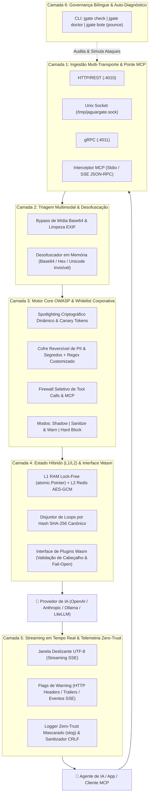

# 🐆 JaguarGate (`jgate` / `onca`)

> **Gateway de Segurança de Ultra-Baixa Latência para IA, Agentes Autônomos e MCP em Go.**  
> *Batizado em homenagem à Panthera onca (a nossa onça-pintada — do Tupi "Yaguara", o predador que neutraliza a ameaça em um único salto).*

[](https://go.dev/)
[](LICENSE)
[](https://owasp.org/www-project-top-10-for-large-language-model-applications/)
[](README.md)

🌍 **Leia em outros idiomas:** [English 🇺🇸](README.md)

---

## ⚡ Por que o JaguarGate?

Proxies de segurança tradicionais tratam o tráfego de IA como páginas web estáticas: se um único parâmetro viola uma regra, eles devolvem um erro `HTTP 403/500`, **derrubando toda a cadeia de raciocínio do seu agente autônomo** e desperdiçando tokens.

O **JaguarGate** é um gateway sidecar resiliente de sub-milissegundos escrito em Go puro (`CGO_ENABLED=0`), desenhado para **LLMs**, **Agentes Autônomos** (AgentScope, LangChain, CrewAI, LiteLLM) e servidores **MCP (Model Context Protocol)**:

* 🛡️ **Degradação Elegante (Pass-Through Seletivo):** Se um agente executar 3 ferramentas em paralelo e 1 não estiver autorizada, o JaguarGate remove cirurgicamente apenas a chamada proibida, mantém a requisição viva (`HTTP 200`) e anexa **Flags de Aviso** (`X-JaguarGate-*`).
* 🧩 **Regras Corporativas Totalmente Desacopladas:** Empresas podem ativar/desativar entidades padrão (`CPF`, `CNPJ`, `CreditCard`, `Email`, `AWSKeys`, `APISecrets`, `JWT`) via YAML/JSON, sobrescrever regexes com `pattern_overrides` ou registrar padrões proprietários (`custom_patterns`) sem alterar código Go.
* 🚀 **Arquitetura Tri-Transporte:** **HTTP/REST** (`:4010`) por padrão para integração sem alterar código, **Unix Domain Sockets (UDS)** para latência quase zero via Kernel com modelos locais (ex: Ollama) e **gRPC/RPC** (`:4011`) com validação obrigatória de metadados Bearer e framing `Grpc-Status: 16 (UNAUTHENTICATED)`.
* 🌊 **Inspeção de Streaming com Recomposição de Fragmentos (SSE):** Remonta argumentos de ferramentas divididos em múltiplos chunks e valida respostas token a token usando janela deslizante UTF-8 nos formatos OpenAI, Anthropic e Ollama.
* 🔐 **Cofre Reversível com Isolamento por Sessão:** Mascara entidades com pseudônimos de 128 bits de entropia (`<JG_PII_{LABEL}_{HEX}>`) isolados no escopo do `sessionID` do cliente, impedindo vazamento de dados entre inquilinos (Multi-Tenant).
* 🔏 **Logger Zero-Trust Extensível:** Reduz dados sensíveis e credenciais dos logs da aplicação com um motor thread-safe linear (`slog`) e sanitização nativa contra injeção de log CRLF (CWE-117 / GoSec G706).
* 🔌 **Guardrail MCP & Firewall Recursivo:** Inspeciona recursivamente chamadas JSON-RPC 2.0 (`tools/call`, `resources/read`) com teto de profundidade (`JG-CFG-203`) e cobertura de campos irmãos contra injeção indireta.
* 🔄 **Disjuntor de Loops por Hash Canônico SHA-256:** Interrompe loops infinitos de agentes em tempo $O(1)$ identificando a assinatura canônica das chamadas repetidas (`tool_name + sorted_json_args`).

---

## 🏗️ Pipeline Arquitetural em 6 Camadas


```mermaid
flowchart TD
    Client["🤖 Agente de IA / App / Cliente MCP"]

    subgraph L1["Camada 1: Ingestão Multi-Transporte & Ponte MCP"]
        HTTP["HTTP/REST (:4010)"]
        UDS["Unix Socket (/tmp/jaguargate.sock)"]
        GRPC["gRPC (:4011)"]
        MCP["Interceptor MCP (Stdio / SSE JSON-RPC)"]
    end

    subgraph L2["Camada 2: Triagem Multimodal & Desofuscação"]
        Media["Bypass de Mídia Base64 & Limpeza EXIF"]
        Deob["Desofuscador em Memória (Base64 / Hex / Unicode Invisível)"]
    end

    subgraph L3["Camada 3: Motor Core OWASP & Whitelist Corporativa"]
        Spot["Spotlighting Criptográfico Dinâmico & Canary Tokens"]
        Vault["Cofre Reversível de PII & Segredos + Regex Customizado"]
        Tools["Firewall Seletivo de Tool Calls & MCP"]
        Modes["Modos: Shadow | Sanitize & Warn | Hard Block"]
    end

    subgraph L4["Camada 4: Estado Híbrido (L1/L2) & Interface Wasm"]
        State["L1 RAM Lock-Free (atomic.Pointer) + L2 Redis AES-GCM"]
        Loop["Disjuntor de Loops por Hash SHA-256 Canônico"]
        Wasm["Interface de Plugins Wasm (Validação de Cabeçalho & Fail-Open)"]
    end

    subgraph L5["Camada 5: Streaming em Tempo Real & Telemetria Zero-Trust"]
        Slide["Janela Deslizante UTF-8 (Streaming SSE)"]
        Flags["Flags de Warning (HTTP Headers / Trailers / Eventos SSE)"]
        Logs["Logger Zero-Trust Mascarado (slog) & Sanitizador CRLF"]
    end

    subgraph L6["Camada 6: Governança Bilíngue & Auto-Diagnóstico"]
        CLI["CLI: jgate check | jgate doctor | jgate bote (pounce)"]
    end

    Upstream["🧠 Provedor de IA (OpenAI / Anthropic / Ollama / LiteLLM)"]

    Client --> L1 --> L2 --> L3 --> L4 --> Upstream
    Upstream --> L5 --> Client
    L6 -.->|"Audita & Simula Ataques"| L1
```

---

## 💻 Comandos da CLI & Como Usar

O JaguarGate inclui uma CLI bilíngue unificada (`jgate`), desenhada tanto para desenvolvedores quanto para automação de CI/CD:

| Comando | Sinônimo (Alias) | Objetivo |
| :--- | :--- | :--- |
| `jgate check` | — | Valida a sintaxe, schemas e invariantes do arquivo `jaguargate.yaml`. |
| `jgate doctor` | — | Diagnostica portas de rede, upstream, permissões de socket e conexão Redis. |
| `jgate bote` | `jgate pounce` | Executa a bateria de ataques Red-Team OWASP Top 10 ($< 2.5\text{ms}$ de execução). |
| `jgate serve` | `jgate start` | Inicia o gateway multi-transporte com hot-reload atômico e telemetria Zero-Trust. |

### Inicializando o Gateway

```bash
# 1. Validar a sintaxe do arquivo de configuração
jgate check -c configs/jaguargate.yaml

# 2. Executar a auditoria de segurança e simulação de ataques
jgate bote

# 3. Iniciar o servidor do gateway
jgate serve -c configs/jaguargate.yaml
```

### Apontando o Tráfego do seu Agente para o JaguarGate

Basta configurar a `BASE_URL` do seu SDK ou cliente de IA para a porta local do JaguarGate (`:4010`):

#### Exemplo com cURL
```bash
curl http://127.0.0.1:4010/v1/chat/completions \
  -H "Content-Type: application/json" \
  -H "Authorization: Bearer sk-sua-chave-api" \
  -d '{
    "model": "gpt-4o",
    "messages": [
      {"role": "system", "content": "Você é um assistente bancário."},
      {"role": "user", "content": "O CPF do cliente é 123.456.789-01. Por favor resuma."}
    ]
  }'
```

#### Exemplo com o SDK Python da OpenAI
```python
from openai import OpenAI

client = OpenAI(
    base_url="http://127.0.0.1:4010/v1",  # Roteia através do JaguarGate
    api_key="sua-chave-api"
)

response = client.chat.completions.create(
    model="gpt-4o",
    messages=[
        {"role": "user", "content": "Meu crachá corporativo é BADGE-ALPHA01"}
    ]
)
print(response.choices[0].message.content)
```

---

## ⚙️ Contrato de Configuração (`jaguargate.yaml`)

### Configuração Mínima (3 Linhas)

Para iniciar rapidamente, defina apenas o bloco `core`; as demais seções herdam os valores recomendados do seu perfil:

```yaml
core:
  version: "1.0"
  language: "pt-BR"      # "pt-BR" ou "en"
  preset: "balanced"     # "permissive" (sombra) | "balanced" (resiliente) | "strict" (blindagem máxima)
```

### Configuração Corporativa Completa

Para controle total sobre regexes customizados, sobrescrita de entidades, logs Zero-Trust e políticas de Whitelist:

```yaml
core:
  version: "1.0"
  language: "pt-BR" # "pt-BR" | "en"
  preset: "balanced"
  mode: "sanitize_and_warn" # "shadow" | "sanitize_and_warn" | "hard_block"

network:
  ingress:
    http:
      enabled: true
      listen_addr: "127.0.0.1:4010"
      read_timeout_ms: 30000
      write_timeout_ms: 120000
    unix_socket:
      enabled: false
      socket_path: "/tmp/jaguargate.sock"
      socket_mode: "0600"
  egress:
    upstream_url: "http://127.0.0.1:11434" # Ollama, vLLM, LiteLLM ou OpenAI

guards:
  # 1. Defesa contra Injeção Direta e Indireta de Prompt
  prompt_injection:
    enabled: true
    # Adicione frases ou comandos restritos da sua empresa
    custom_patterns:
      - '(?i)exfiltrar\s+base\s+de\s+clientes'
      - '(?i)superadmin_bypass_token'

  # 2. Desofuscação (Unicode Invisível e Smuggling Base64/Hex Aninhado)
  deobfuscation:
    enabled: true
    decode_base64: true
    decode_hex: true
    strip_invisible_unicode: true
    max_decode_depth: 2

  # 3. Higiene Multimodal
  multimodal:
    bypass_regex_on_media: true
    strip_exif_xmp_metadata: true
    verify_magic_bytes: true

  # 4. Cofre Reversível de PII & Segredos
  pii_vault:
    enabled: true
    restore_on_output: true
    ttl_seconds: 300
    entities:
      cpf: true
      cnpj: true
      credit_card: true
      email: false
      aws_keys: true
      api_secrets: true
      jwt_tokens: true
    # Padrões de regex corporativos para crachás, tokens proprietários ou IDs internos
    custom_patterns:
      - name: "CORP_BADGE"
        regex: '\bBADGE-[A-Z0-9]{8}\b'
        is_secret: false
        enabled: true
      - name: "INTERNAL_TOKEN"
        regex: '\bcorp_sec_[a-f0-9]{32}\b'
        is_secret: true
        enabled: true
    # Sobrescrita de padrões nativos (ex: aceitar CPF sem pontuação)
    pattern_overrides:
      cpf: '\b\d{11}\b'

whitelist:
  enforce_tool_whitelist: false
  allowed_tools:
    - "search_knowledge_base"
    - "get_weather"
  allowed_domains:
    - "*.suaempresa.com.br"
    - "api.github.com"
  circuit_breaker:
    max_identical_tool_calls: 3
    window_seconds: 120
    max_tokens_per_session: 32000

telemetry:
  logging:
    level: "info"
    format: "json"
    zero_trust_redaction: true
    redaction_placeholder: "***[JG-REDACTED]***"
    # Padrões adicionais mascarados nos logs
    custom_patterns:
      - '\bCORP-SECRET-[0-9]{6}\b'
    # Campos JSON que nunca são gravados em texto puro
    sensitive_fields:
      - "client_secret"
      - "master_key"
      - "user_password"
```

---

## 🌐 Configuração de Idioma (`en` Default | `pt-BR`)

O JaguarGate exibe todas as tabelas e saídas de CLI em **Inglês (`en`)** por padrão para manter a saída limpa em pipelines de CI/CD e SIEM. Alterne para **Português (`pt-BR`)** a qualquer momento:

1. **Flag na CLI:**
   ```bash
   jgate doctor --lang pt-BR
   jgate bote --lang pt-BR
   ```
2. **Variável de Ambiente:**
   ```bash
   export JAGUARGATE_LANG="pt-BR"
   jgate serve -c configs/jaguargate.yaml
   ```
3. **Arquivo de Configuração:**
   ```yaml
   core:
     language: "pt-BR"
   ```

---

## 🎯 Matriz de Suporte por Protocolo e Provedor

| Família de Modelo / Protocolo | Transporte de Entrada | Saída Não-Streaming | Streaming (SSE) | Governança de Tool Calls |
| :--- | :--- | :---: | :---: | :--- |
| **OpenAI / LiteLLM / vLLM** | HTTP (`:4010`), UDS, gRPC (`:4011`) | Total (`choices[].message`) | Total (`choices[].delta`) | Total (Recomposição multi-chunk & domínios) |
| **Anthropic (Messages API)** | HTTP (`:4010`), UDS, gRPC (`:4011`) | Total (`content[].text` & `content[].tool_use`) | Total (`delta.text`) | Total (`tool_use` podado com recusa graciosa) |
| **Ollama** | HTTP (`:4010`), UDS (Latência Zero) | Total (`message.content`, `response`) | Total (`message.content`, `response`) | Total (`tool_calls` validados na Whitelist) |
| **MCP (Model Context Protocol)** | Stdio & HTTP/SSE (JSON-RPC 2.0) | Total (`result.content`, `resources/read`) | — | Total (Varredura recursiva & teto profundidade $\le 8$) |

---

## 📊 Cobertura OWASP Top 10 para LLMs e Agentes

| Ameaça OWASP | Mecanismo de Defesa do JaguarGate | Comportamento Resiliente (`sanitize_and_warn`) |
| :--- | :--- | :--- |
| **LLM01: Prompt Injection** | Motor Linear RE2 + Assinaturas Customizadas + Spotlighting Dinâmico | Neutraliza o trecho malicioso; encaminha o contexto limpo + `JG-SEC-401` |
| **LLM02: Vazamento de Dados (PII)** | Cofre Reversível de PII & Segredos (Isolado por Sessão + Regex Customizado) | Substitui entidade por `<JG_PII_{LABEL}_{HEX}>` + `JG-PII-301`/`JG-PII-302` |
| **LLM05: Manipulação de Saída** | Bloqueador de imagens rastreadoras em Markdown e scripts | Remove links maliciosos no streaming SSE em tempo real + `JG-SEC-502` |
| **LLM06: Agência Excessiva** | Firewall Seletivo de *Tool Calls* e JSON-RPC 2.0 MCP | Remove a ferramenta não autorizada sem quebrar a requisição `HTTP 200` + `JG-CFG-101` |
| **LLM07: Vazamento de System Prompt** | Injeção invisível de *Canary Token* e detecção em streaming SSE | Corta imediatamente a transmissão que vazou o prompt + `JG-SEC-501` |
| **LLM10: Consumo Ilimitado / Loops** | Disjuntor de Loops por Hash SHA-256 Canônico e limites de tokens | Interrompe chamadas repetidas idênticas sem derrubar o agente + `JG-CFG-201` |

---

## 🧪 Verificação de Segurança & Bateria Red-Team

Toda alteração passa por baterias rigorosas com verificação estática e detecção de corrida (`-race`):

```bash
# Executar testes unitários e de concorrência
go test -race ./...

# Executar a bateria de ataques simulados
jgate bote
```

```
===========================================================================================================
  JAGUARGATE RED-TEAMING SUITE (jgate pounce) — RELATÓRIO DE AUDITORIA DE SEGURANÇA
===========================================================================================================
ID      | CATEGORIA    | CENÁRIO DE ATAQUE SIMULADO                      | FLAGS DISPARADAS      | LAT.   | STATUS
-----------------------------------------------------------------------------------------------------------
VEC-01  | OWASP-LLM01  | Neutralização Direta de Prompt Injection        | JG-SEC-401            |  136µs | PASS  
VEC-02  | OWASP-OBFUSC | Defesa contra Unicode Invisível + Base64        | JG-SEC-402,JG-SEC-401 |  255µs | PASS  
VEC-03  | MULTIMODAL   | Remoção de Payload Oculto em EXIF de JPEG       | JG-SEC-403            |    2µs | PASS  
VEC-04  | OWASP-LLM02  | Cofre Reversível de PII (CPF + CNPJ Alfanum. + Segredo) | JG-PII-301,JG-PII-302 |  109µs | PASS  
VEC-05  | OWASP-LLM06  | Poda Cirúrgica de Tool Calls Não Autorizadas    | JG-CFG-101            |   42µs | PASS  
VEC-06  | AGENT-LOOP   | Disjuntor O(1) SHA-256 de Loops de Agentes      | JG-CFG-201            |   17µs | PASS  
VEC-07  | MCP-GUARD    | Firewall de Servidores MCP e JSON-RPC 2.0       | JG-CFG-102,JG-CFG-101 |   22µs | PASS  
VEC-08  | SSE-STREAM   | Truncamento Imediato de Vazamento de Canary SSE | JG-SEC-501            |   76µs | PASS  
-----------------------------------------------------------------------------------------------------------
  VEREDITO: APROVADO (8/8 Vetores de Ataque Neutralizados) | Duração Total: 692µs
===========================================================================================================
```

---

## 📄 Licença

Distribuído sob a **Apache License 2.0**. Veja [`LICENSE`](LICENSE) para mais detalhes.
